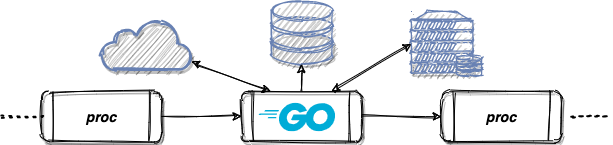

# tpack
[](https://github.com/reugn/tpack/actions?query=workflow%3ATest)
[](https://pkg.go.dev/github.com/reugn/tpack)
[](https://goreportcard.com/report/github.com/reugn/tpack)

Pack a Go workflow/function as a Unix-style pipeline command.



> [Wiki](https://en.wikipedia.org/wiki/Pipeline_(Unix))  
> In Unix-like computer operating systems, a pipeline is a mechanism for inter-process communication using message passing. A pipeline is a set of processes chained together by their standard streams, so that the output text of each process (stdout) is passed directly as input (stdin) to the next one.

Use `tpack` to write Go applications that act as pipeline commands.
Employ channels, goroutines, regular expressions and more to build powerful concurrent workflows.

## Examples
See ETL workflow in the examples folder.
```go
package main

import "github.com/reugn/tpack"

func main() {
	tpack.NewPackerStd(tpack.NewFunctionProcessor(
		doETL,
	)).Execute()
}
```
Test command
```sh
cat input.txt | go run *.go 2>/dev/null | wc -l
```

## License
Licensed under the MIT License.